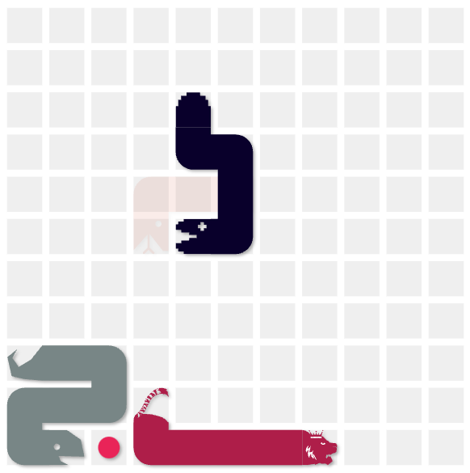

---
presentation:
    width: 1440
    height: 900
---

<!-- 8min talk, 2min Q&A -->
<!-- slide -->
# Resource-Constrained Deep Reinforcement Learning for Battlesnake

Steven Hé (Sīchàng)

STATS 402 by Prof. Peng Sun

Duke Kunshan University

<!-- slide -->
## Overview

- Battlesnake + deep reinforcement learning
- Purely deep-reinforcement-learning-based
- Resource constraint
- Benchmark & real-world competition

<!-- slide id game-animation -->

- Battlesnake: online programming competition
- Large search space, time horizon, 500ms constraint
- Heuristics, tree search

<!-- slide -->
## Inspirations to be Purely DRL-based

- AlphaZero (2017)
    - Chess, Shogi, Go
    - Deep reinforcement learning w/o knowing the game
- OpenAI Five (2019)
    - Beat Dota 2 champion
    - Proximal Policy Optimization (PPO)

Prior RL Battlesnake agents used heuristics

<!-- slide -->

Cloud VMs/ Raspberry Pis

<!-- slide -->
## Resource Constraint

- Fairness/practicality: no powerful computers
- Inference time vs model capability
- Target: 440ms on Duke VM (2CPU, 3.6G RAM)
    - $\approx$ 2 Pis

<!-- slide -->
## Training Plan

- Open-source implementation references
- PPO w/ Gymnasium + Stable Baselines3
- 20% old self, ∼ AlphaZero/ OpenAI Five
- Train simple example → design full model

<!-- slide -->
## Feature Extraction

10 of 21x21 layers

- Center our head & face upwards ⇒ wall layer
- Body segment: how long stay
- Opponent head: relative length
- Food: how hungry

<!-- slide -->
## Evaluation Plan

- Benchmark: maxn tree-search snake *ich heisse marvin* (6th)
- Real-world competition: deploy on Duke VM + join leaderboard

<!-- slide -->
## Expected Results

- Competitive against tree search
- Improvement in win rate over training
- Top 20 on standard leaderboard given time

<!-- slide -->
## Resource-constrained deep reinforcement learning for Battlesnake

- Purely DRL-based, no heuristics
- Balance inference time & model capability
- Evaluation w/ tree search agent & players worldwide
